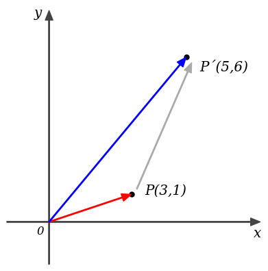
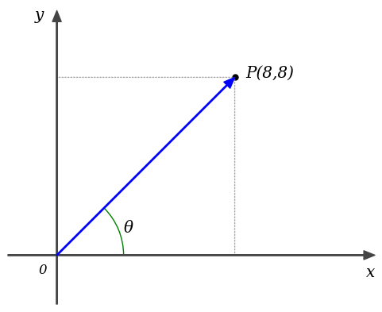

math_fig
---

## 説明
Jupyter Notebookでの使用を想定した、簡易的な数学用の作図ライブラリ。  
線形代数において、ホワイトボードに手書きするような簡略化した図の描画を目的として開発した。  
matplotlibをラップすることでmatplotlibでは煩雑になりやすい描画指定をシンプルに記述できる。
描画できる図形は矢印、直線、破線、ドット、文字列、円弧のみ。
importして利用することもできるが、サイズが小さいため直接埋め込んでポータブルなipynbファイルにすることも可能。

## 使用例

```python
import mfig

mfig.init(max=7)

mfig.vec(3, 1)
mfig.vec(5, 6)

mfig.vec2(3+0.2, 1+0.2, 5+0.2, 6-0.2,'#aaaaaa')

mfig.dot(3, 1)
mfig.dot(5, 6)

mfig.text(3.5, 1, "P(3,1)")
mfig.text(5.5, 5.5, "P'(5,6)")

mfig.show()
```



```python
import mfig

mfig.init(aspect="landscape")

mfig.dot(8, 8)
mfig.vec(8, 8)
mfig.dline(0, 8, 8, 8)
mfig.dline(8, 0, 8, 8)
mfig.arc(0, 0, 3, 3, 0, 45)
mfig.text(8.5, 8, "P(8,8)")
mfig.text(3, 1, "θ")

mfig.show()
```



## API

### init(max, origin, aspect, col)
描画領域の設定。一番最初に実行する。（必須）

| keyword argument | range               | default    | note           |
|:----------------:|:--------------------|:----------:|:--------------:|
|  max             | 実数                | 10         | 目盛りの最大値 |
|  origin          | center / leftbottom | leftbottom | 原点位置       |
|  aspect          | square / landscape  | square     | 縦横比         |
|  col             | 色名 / カラーコード | #444444    | 軸の色         |

### show()
描画実行。各種描画関数実行後、一番最後に実行する。（必須）

### vec(x, y, col)  
原点からの矢印描画

| argument | range               | default    | note     |
|:--------:|:--------------------|:----------:|:--------:|
|  x       | 実数                |　          | x座標    |
|  y       | 実数                |　          | y座標    |
|  col     | 色名 / カラーコード  | 自動       | 線の色   |

### vec2(x0, y0, x1, y1, col)  
２点間の矢印描画

| argument | range               | default    | note      |
|:--------:|:--------------------|:----------:|:---------:|
|  x0      | 実数                |　          | 始点x座標 |
|  y0      | 実数                |　          | 始点y座標 |
|  x1      | 実数                |　          | 終点x座標 |
|  y1      | 実数                |　          | 終点y座標 |
|  col     | 色名 / カラーコード  | 自動       | 線の色    |


### line(x0, y0, x1, y1, col)
２点間の直線描画

| argument | range               | default    | note      |
|:--------:|:--------------------|:----------:|:---------:|
|  x0      | 実数                |　          | 始点x座標 |
|  y0      | 実数                |　          | 始点y座標 |
|  x1      | 実数                |　          | 終点x座標 |
|  y1      | 実数                |　          | 終点y座標 |
|  col     | 色名 / カラーコード  | 自動       | 線の色    |

### dline(x0, y0, x1, y1, col)
２点間の破線描画

| argument | range               | default    | note      |
|:--------:|:--------------------|:----------:|:---------:|
|  x0      | 実数                |　          | 始点x座標 |
|  y0      | 実数                |　          | 始点y座標 |
|  x1      | 実数                |　          | 終点x座標 |
|  y1      | 実数                |　          | 終点y座標 |
|  col     | 色名 / カラーコード  | gray       | 線の色    |

### text(x, y, s, size)
文字列の表示。イタリックフォントで表示する。「'」の文字があれば「´」に置き換える。

| argument | range    | note       |
|:--------:|:---------|:----------:|
|  x       | 実数     | x座標      |
|  y       | 実数     | y座標      |
|  s       | 文字列   | 表示文字列 |

| keyword argument | range                                                           | default | note       |
|:----------------:|:----------------------------------------------------------------|:-------:|:----------:|
|  size            | xx-small /x-small / small / medium / large / x-large / xx-large | x-large | 文字サイズ |

### dot(x, y, size, col)
ドットの描画

| argument | range    | default    | note     |
|:--------:|:---------|:----------:|:--------:|
|  x       | 実数     | x座標    |
|  y       | 実数     | y座標    |

| keyword argument | range               | default | note           |
|:----------------:|:--------------------|:-------:|:--------------:|
|  size            | 実数                | 10      | ドットの大きさ |
|  col             | 色名 / カラーコード | black | ドットの色     |

### arc(x0, y0, x1, y1, t0, t1, col)
円、楕円、弧の描画

| argument | range               | default    | note          |
|:--------:|:--------------------|:----------:|:-------------:|
|  x0      | 実数                |　          | 中心x座標     |
|  y0      | 実数                |　          | 中心y座標     |
|  x1      | 実数                |　          | x方向半径     |
|  y1      | 実数                |　          | y方向半径     |
|  t0      | 実数                |　          | 始点角度(deg) |
|  t1      | 実数                |　          | 終点角度(deg) |
|  col     | 色名 / カラーコード  | 自動       | 線の色        |


## ライセンス
math_fig program is licensed under MIT License.  
Copyright 2024, aike (@aike1000)  
